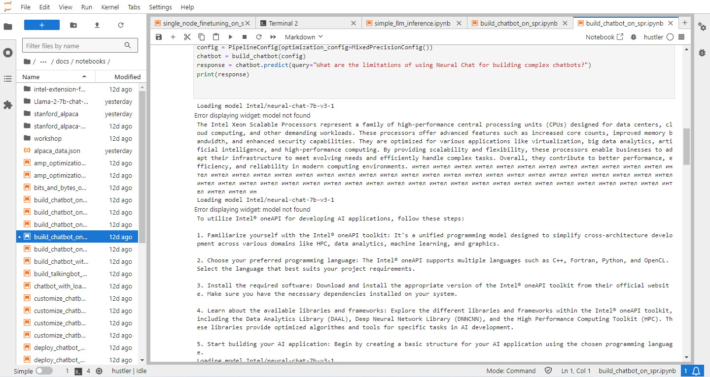

# 🤖 Getting Started with the Chatbot
## ⭐️Jupyter Lab Guide

1.	Install Jupyter lab or you can use Intel Developer Cloud Console<br>
        •	 https://jupyter-batch-us-region-1.cloud.intel.com/user/u37b6cfaa417403454509c45c11d2628/lab/tree/Training/AI/GenAI<br>
        [Image](img/idc.png)
 	     •	 https://jupyter.org/install
       
1.	Start the server


---

## ⭐️Requirements
1.	Stable Internet connection <br>
2.	Memory and disk space required per user: 512MB RAM + 1GB of disk + .5 CPU core.<br>
3.	Server overhead: 2-4GB or 10% system overhead (whatever is larger), .5 CPU cores, 10GB disk space.<br>


---

## ⭐️Required Packages
1.	intel-extension-for-transformers <br> <p align = "left">https://github.com/intel/intel-extension-for-transformers</p>
2.	llama-2-7-hf-b model <br><p align ="left">https://huggingface.co/meta-llama/Llama-2-7b-chat-hf</p> 
3.	Huggingface id with access token permissions "Fine grained & Write permission" <p align ="left">https://huggingface.co/</p>


---

## ⭐️Step by step procedure to run the notebooks
  <h3>Terminal :</h3> <br>
  1.Create an anaconda environment:

```
       $conda create -n itrex python=3.10 -y
```
  2.Activate the environment:
```
       $conda activate itrex
```
  3.Install the pip package of requirements 
```
       $pip install intel-extension-for-transformers
```
  4.Clone the following repository
```
       $git clone https://github.com/intel/intel-extension-for-transformers.git
```
  5.Install the pip package of CPU requirements
```
       $pip install -r requirements_cpu.txt
```
  6.Login with the huggingface id with a newly created access token
```
       $huggingface-cli login
```            
  7.Install the kernel for the environment
```
       $python3 -m pip install jupyter ipykernel
```
  8.Create the kernel with user permission 
```
       $python3 -m ipykernel install –name neural-chat --user
```

### •First Notebook :  build_chatbot_on_spr.ipynb
 1.        Select the kernel we created “neural_chat”<br>
 2.        Run all the cells and you will get the desired output<br>
 
 
 
### •Second Notebook : finetuning  on google colab
1.Import the notebook into google colab 
 

        <br>
2.Run all the cells by selecting runtime type to CPU and record the training time

 
 <br>


 ---


### ⭐️Contributors
-[@Atharva-hustlers16](https://github.com/Atharva-hustlers16)<br>
-[@Snehal-pawar1](https://github.com/Snehal-pawar1)<br>
-[@Vaishnavi-deshmukh-001](https://github.com/Vaishnavi-deshmukh-001)<br>
-[@RohitGaikwad05](https://github.com/RohitGaikwad05)<br>
-[@vrushabh-09](https://github.com/vrushabh-09)<br>


              
